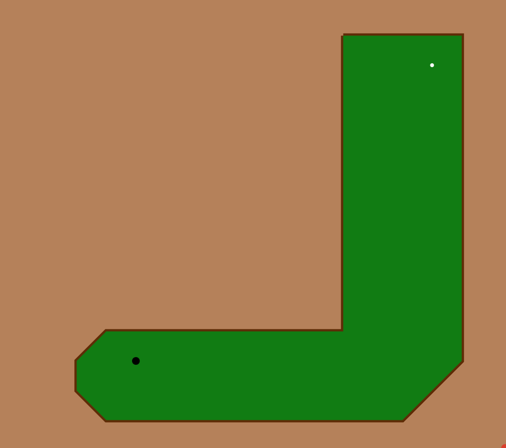

An idle game where you play mini-golf. Takes about 30 minutes to finish. Works on mobile or with a mouse.

[Play online](https://za3k.github.io/idle-golf/) here.

Written by [Zachary "za3k" Vance](https://za3k.com) as part of Hack-a-Day. [Hack-a-Day](https://za3k.com/hackaday) is a challenge to do one project every day in November.

Thanks to Zaraya for playtesting.
